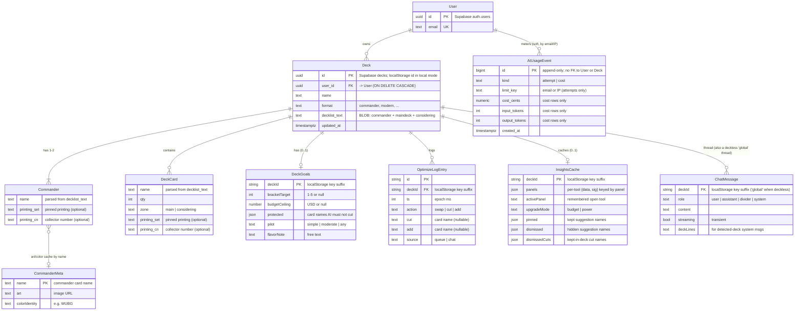

# MTG Workshop — Data Model (ERD)

A logical entity-relationship view of everything the app persists. It is deliberately
**normalized** — modeled as clean relational entities — even though the real storage
is split and, in places, denormalized. Two things make this model unusual:

1. **The data lives in two places.** A little is server-side in **Supabase**; most of
   the per-deck state lives in the browser's **`localStorage`**, keyed by deck id.
2. **A Deck is a text blob.** `decks.decklist_text` holds the commander, maindeck, and
   Considering list as one string. `Commander` and `DeckCard` below are *parse-time
   views* of that text (`disassembleDecklist` / `assembleForStorage`), not stored rows.

## Legend — where each entity lives

| Entity | Storage | Source of truth |
|--------|---------|-----------------|
| **User** | Supabase — `auth.users` (managed) | Supabase auth |
| **Deck** | Supabase — `decks` table (RLS: owner-only) | `frontend/src/lib/store.js`, README SQL |
| **AIUsageEvent** | Supabase — `ai_usage_events` (append-only, RLS: backend-only) | `backend/app/usage.py` |
| **Commander** | *Derived* — parsed from `decklist_text` | `frontend/src/lib/deckParser.js` |
| **DeckCard** | *Derived* — parsed from `decklist_text` | `frontend/src/lib/deckParser.js`, `App.jsx` |
| **DeckGoals** | localStorage — `mtgweb:goals:{deckId}` | `frontend/src/lib/goals.js` |
| **OptimizeLogEntry** | localStorage — `mtgweb:optlog:{deckId}` (cap 60) | `frontend/src/lib/optimizeLog.js` |
| **InsightsCache** | localStorage — `mtgweb:insights:{deckId}` | `frontend/src/lib/insightsCache.js` |
| **ChatMessage** | localStorage — `mtgweb:pwchat:{deckId\|\|"global"}` (cap 40) | `frontend/src/components/Planeswalker.jsx` |
| **CommanderMeta** | localStorage — `mtgweb:commanderMeta` (cache) | `frontend/src/components/MyDecks.jsx` |

## Diagram

> Mermaid `erDiagram` has no native "subgraph" grouping, so storage is annotated in
> each entity's comments instead. Read the **Legend** table alongside the diagram to
> see the Supabase / derived / localStorage split at a glance.

## Field reference

### User — `auth.users` (Supabase-managed)
| Field | Type | Notes |
|-------|------|-------|
| id | uuid (PK) | Supabase auth user id |
| email | text | Also the `limit_key` for signed-in AI rate limiting |

### Deck — `decks` table (Supabase; RLS owner-only)
| Field | Type | Notes |
|-------|------|-------|
| id | uuid (PK) | In local mode, a client-generated id from `store.js`'s `uid()` |
| user_id | uuid (FK → User) | `ON DELETE CASCADE`; absent in local mode |
| name | text | |
| format | text | `commander`, `modern`, etc. |
| decklist_text | text | **Denormalized blob** — commander + maindeck + Considering |
| updated_at | timestamptz | Sort key for the deck list |

### AIUsageEvent — `ai_usage_events` (Supabase; append-only)
| Field | Type | Notes |
|-------|------|-------|
| id | bigint (PK) | |
| kind | text | `attempt` (rate limit) or `cost` (budget) |
| limit_key | text | email or client IP; **attempt rows only** |
| cost_cents | numeric | **cost rows only** |
| input_tokens / output_tokens | int | **cost rows only** |
| created_at | timestamptz | Windowed by day (attempts) / month (cost) |

### Commander & DeckCard — *derived from `decklist_text`*
Not stored as rows. Parsed on load via `disassembleDecklist`, re-serialized on save
via `assembleForStorage`. `Commander` is 1–2 per deck (partners); `DeckCard.zone`
separates the maindeck from the Considering pile. A pinned printing travels inline as
`N Card (SET) 123`.

### DeckGoals — `mtgweb:goals:{deckId}` (localStorage)
| Field | Type | Notes |
|-------|------|-------|
| bracketTarget | int\|null | 1–5, or null = "keep current" |
| budgetCeiling | number\|null | USD |
| protected | string[] | Card names the AI must never cut/replace |
| pilot | text | `simple` \| `moderate` \| `any` |
| flavorNote | text | Free text, threaded into AI prompts |

### OptimizeLogEntry — `mtgweb:optlog:{deckId}` (localStorage, cap 60)
| Field | Type | Notes |
|-------|------|-------|
| id | string (PK) | |
| ts | int | epoch ms |
| action | text | `swap` \| `cut` \| `add` |
| cut / add | text\|null | Card names; used to invert the change on Undo |
| source | text | `queue` or `chat` |

### InsightsCache — `mtgweb:insights:{deckId}` (localStorage)
| Field | Type | Notes |
|-------|------|-------|
| panels | json | Per-tool `{data, sig}`; `sig` is the deck's card-presence signature |
| activePanel | text | Remembered open tool |
| upgradeMode | text | `budget` \| `power` |
| pinned / dismissed / dismissedCuts | string[] | User verdicts on individual suggestions; survive deck edits |

### ChatMessage — `mtgweb:pwchat:{deckId||"global"}` (localStorage, cap 40)
| Field | Type | Notes |
|-------|------|-------|
| role | text | `user` \| `assistant` \| `divider` \| `system` |
| content | text | |
| streaming | bool | Transient (per-token), not persisted mid-stream |
| deckLines | text | Present on `_deck_detected_` system messages |

### CommanderMeta — `mtgweb:commanderMeta` (localStorage cache)
Keyed by commander **name** (not deckId): `{ art, colorIdentity }`. Lets the My Decks
list paint art + color pips instantly on return visits.

## Denormalization & boundaries

- **A Deck is text.** `decklist_text` is the single source; `Commander`/`DeckCard` are
  parse-time views. There is no card/quantity/printing table — those live in the string.
- **Satellites can exist before the Deck row.** localStorage keys use `deckId`, with
  sentinels `"current"` (an unsaved deck) and `"global"` (a deckless chat thread), so
  goals/log/insights/chat can accumulate before the deck is ever saved to Supabase.
- **AIUsageEvent is unlinked.** It has no real FK — `attempt` rows key on email or IP,
  `cost` rows carry no caller — and it never references a Deck. The `User ⟶ AIUsageEvent`
  edge above is a *soft* association by email string only.
- **Client state does not sync.** DeckGoals, OptimizeLog, InsightsCache, ChatMessage,
  and CommanderMeta are localStorage-only today — per-browser, lost on clear, moved
  between devices only when the parent Deck is exported/re-imported. Folding them into a
  Supabase `jsonb` column alongside `decks` is a noted future step.
- **Not modeled here** (plain UI settings, not domain data): `mtgweb:theme`,
  `mtgweb:rememberedEmail`, `mtgweb:rememberMe`, `mtgweb:pwexpand`, `mtgweb:pwtext`,
  `mtgweb:pwseen`, `mtgweb:optCollapsed`, `mtgweb:playtestnudge:{deckId}`.
